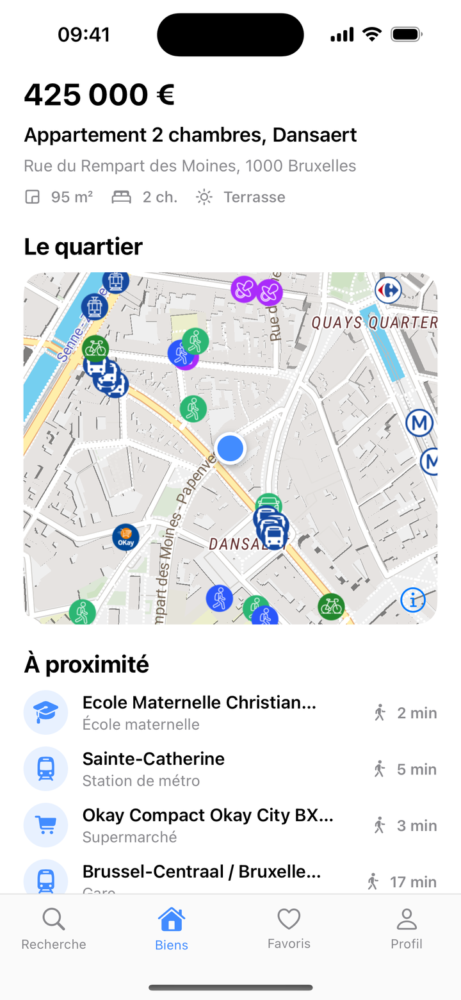

# @yatmo/react-native

[](https://github.com/yatmo/yatmo-sdk-react-native/actions/workflows/ci.yml)
[](https://www.npmjs.com/package/@yatmo/react-native)
[](LICENSE)

Neighbourhood intelligence for real-estate apps: the [Yatmo](https://yatmo.com) map with the points of interest, travel times and neighbourhood summaries your listing pages need, in React Native. Built on [`@maplibre/maplibre-react-native`](https://github.com/maplibre/maplibre-react-native), no Google Maps key required. TypeScript, new architecture.

<p align="center">
  
  
</p>

## Requirements

- React Native 0.76+, `@maplibre/maplibre-react-native` 11+ (native module: rebuild the app after installing)
- A Yatmo licence: the **frontend key** and your iOS bundle id / Android applicationId registered as [app ids](https://documentation.yatmo.com/mobile/app-ids)

## Installation

```bash
npm install @yatmo/react-native @maplibre/maplibre-react-native
npm install react-native-webview   # optional, for <YatmoWebView>
cd ios && pod install
```

## Quick start

```tsx
import { Platform } from 'react-native';
import { createYatmoClient, YatmoMapView } from '@yatmo/react-native';

const yatmo = createYatmoClient({
  licenseKey: 'YOUR_FRONTEND_KEY',
  country: 'BE',
  language: 'FR',
  appId: Platform.select({ ios: 'com.myagency.homes', android: 'com.myagency.homes.android' })!,
});

export function ListingMap() {
  return (
    <YatmoMapView
      client={yatmo}
      property={{ latitude: 50.8520525, longitude: 4.3442926 }}
      zoom={15}
      isochrones="walking"                      // 5 / 10 / 20 minute areas, camera fitted like the web plugin
      onPoiSelected={(poi) => console.log(poi.name, poi.type)}
      style={{ height: 320 }}
    />
  );
}

const summary = await yatmo.summary({ latitude: 50.8520525, longitude: 4.3442926 });
const enrichment = await yatmo.enrichment({ latitude: 50.8520525, longitude: 4.3442926 });
```

JavaScript cannot read the bundle id by itself: pass the id of the running platform (`react-native-device-info`'s `getBundleId()` works too). It is sent with every request; register it on your licence, otherwise the API answers 403.

## What is inside

| Export | Role |
|---|---|
| `createYatmoClient`, `YatmoClient` | Typed client on `fetch`: `summary`, `summaryText`, `scores`, `enrichment`, `points`, `isochrones`, `geocode`, `simplifiedCategories`, `pluginUrl` |
| `YatmoMapView` | MapLibre `Map` with a Yatmo style, property pin, POI markers following the camera, isochrones, tap callback; children pass through |
| `YatmoWebView` (from `@yatmo/react-native/webview`) | `react-native-webview` preloaded with the Yatmo iframe plugin |

Full guide: https://documentation.yatmo.com/mobile/react-native

## Example app

`example/` is a React Native CLI app that shows the map and exercises every client call. Put your key in `example/licenseKey.local.js` (ignored by git):

```js
module.exports = { key: 'YOUR_FRONTEND_KEY' };
```

then `cd example && npm install --legacy-peer-deps && npx react-native run-android` (or `run-ios`).

## Development

```bash
npm install --legacy-peer-deps   # the MapLibre plugin has an optional Expo peer dependency
npm run typecheck
npm run build                    # emits lib/
```

## Licence

The SDK is released under the [MIT licence](LICENSE). Using the Yatmo API requires a licence key: https://yatmo.com
